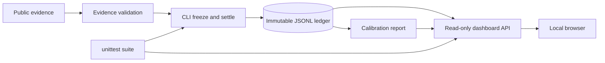

# 系统架构

```mermaid
flowchart LR
  S[Public evidence] --> V[Evidence validation]
  V --> C[CLI freeze and settle]
  C --> L[(Immutable JSONL ledger)]
  L --> R[Calibration report]
  L --> D[Read-only dashboard API]
  R --> D
  D --> U[Local browser]
  T[unittest suite] --> C
  T --> D
```

只有 CLI 可以追加台账记录。仪表盘只读取台账和调度日志，仅绑定回环地址，不暴露任何修改数据的接口。
