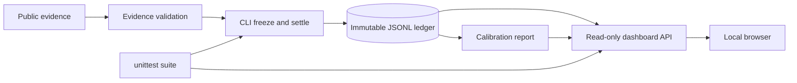

# Architecture

```mermaid
flowchart LR
  S[Public evidence] --> V[Evidence validation]
  V --> C[CLI freeze and settle]
  C --> L[(Immutable JSONL ledger)]
  L --> R[Calibration report]
  L --> D[Read-only dashboard API]
  R --> D
  D --> U[Local browser]
  T[unittest suite] --> C
  T --> D
```

Only the CLI appends ledger records. The dashboard reads the ledger and scheduler log, binds only to loopback, and exposes no mutation endpoint.
